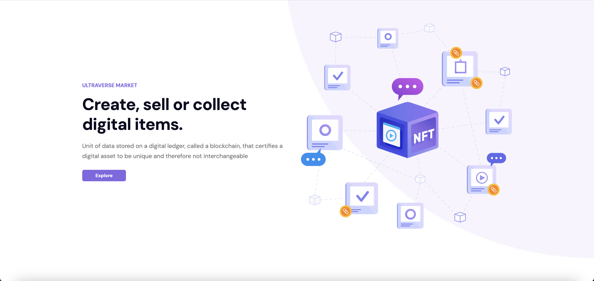
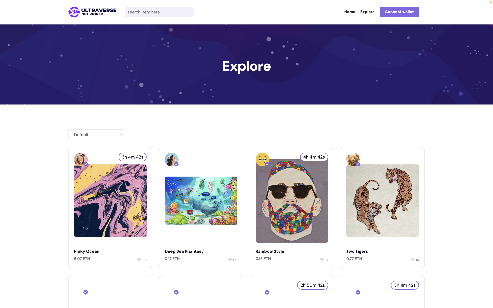
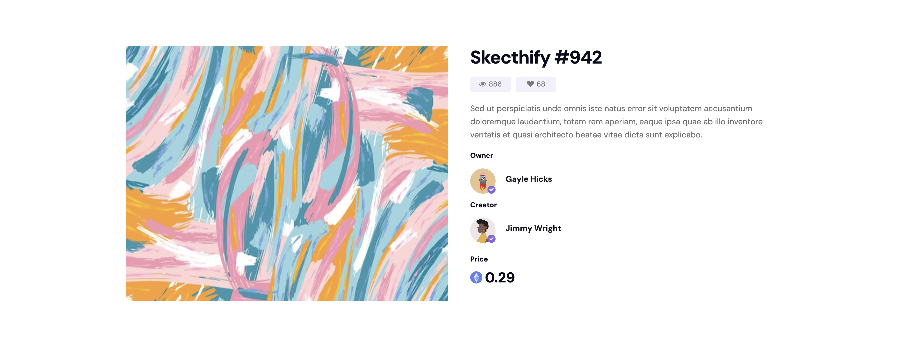

# NFT Ultraverse

> A clean, responsive NFT marketplace for browsing collections, exploring items, and viewing creator profiles.


---

## Screenshots






---

## About

NFT Ultraverse is a frontend NFT marketplace built with React. It lets users browse hot collections, discover new items, explore the full catalogue with filtering, and dig into individual NFT and creator pages — all backed by a live Google Cloud Functions API.

The project started from a Create React App scaffold and was built out into a multi-page application with real API data, skeleton loading states, scroll-triggered animations, and a responsive layout that works across device sizes.

It's a solid reference for how to structure a data-driven React SPA: consistent fetching patterns across every page, a shared card component reused throughout, and skeleton loaders that match the exact shape of the content they replace.

---

## Features

- **Home page** with hero section, hot collections carousel, new items grid, top sellers list, and browse-by-category section
- **Explore page** with live filtering by price (low-to-high, high-to-low) and likes (most liked)
- **Item details page** showing NFT metadata, owner, creator, and auction countdown timer
- **Author/creator profile pages** with profile banner, follower count, and the author's full NFT collection
- **Skeleton loaders** for every data-fetching section — each skeleton matches the layout of the real content
- **Scroll-triggered animations** via AOS on all major sections
- **Responsive navigation** with a mobile hamburger menu
- **Carousel/slider** for hot collections (react-slick) and new items (keen-slider)

---

## Tech Stack

| Category    | Technology                          |
|-------------|-------------------------------------|
| Framework   | React 17.0.2                        |
| Routing     | React Router DOM 6.2.2              |
| HTTP Client | Axios 1.8.4                         |
| Styling     | Bootstrap (CSS) + custom CSS        |
| Animations  | AOS 3.0.0-beta.6                    |
| Carousels   | react-slick 0.30.3 / keen-slider 6.8.6 |
| Icons       | react-icons 4.3.1                   |
| Skeletons   | react-loading-skeleton 3.5.0        |
| Backend     | Google Cloud Functions (external)   |
| Auth/DB     | Firebase 9.8.4 (installed, unused)  |
| Toolchain   | Create React App / react-scripts 5  |

---

## Project Structure

```
nft-ultraverse/
├── public/                   # Static HTML, manifest, favicon
├── src/
│   ├── pages/                # Top-level page components
│   │   ├── Home.jsx          # Assembles all home sections
│   │   ├── Explore.jsx       # Explore page with filter state
│   │   ├── Author.jsx        # Author profile page
│   │   └── ItemDetails.jsx   # Single NFT detail page
│   │
│   ├── components/
│   │   ├── home/             # Section components used only on Home
│   │   │   ├── Landing.jsx
│   │   │   ├── LandingIntro.jsx
│   │   │   ├── HotCollections.jsx
│   │   │   ├── NewItems.jsx
│   │   │   ├── TopSellers.jsx
│   │   │   └── BrowseByCategory.jsx
│   │   │
│   │   ├── explore/          # Components for the Explore page
│   │   │   ├── ExploreItems.jsx
│   │   │   └── HeaderExplore.jsx
│   │   │
│   │   ├── author/           # Components for Author profile
│   │   │   └── AuthorItems.jsx
│   │   │
│   │   ├── UI/
│   │   │   └── Skeleton.jsx  # Base skeleton wrapper
│   │   │
│   │   ├── Nav.jsx           # Top navigation bar
│   │   ├── Footer.jsx        # Site footer
│   │   ├── NftCard.jsx       # Shared NFT card used across pages
│   │   ├── Timer.jsx         # Auction countdown timer
│   │   └── *Skeleton.jsx     # Per-section skeleton loaders
│   │
│   ├── css/
│   │   ├── styles/           # Bootstrap + custom stylesheets
│   │   ├── colors/           # Color variable definitions
│   │   └── fonts/            # Custom icon fonts (et-line, elegant_font)
│   │
│   ├── images/               # Static image assets (logo, banners, icons)
│   ├── App.jsx               # Router setup, global SkeletonTheme
│   └── index.jsx             # React entry point
│
├── CLAUDE.md                 # Guidance for Claude Code
└── package.json
```

---

## Getting Started

### Prerequisites

- Node.js 16+ and npm

### Installation

```bash
git clone https://github.com/your-username/nft-ultraverse.git
cd nft-ultraverse
npm install
npm start
```

The app runs at [http://localhost:3000](http://localhost:3000).

### Build for Production

```bash
npm run build
```

---

## Environment Variables

This project does not currently use any environment variables. The API base URL (`https://us-central1-nft-cloud-functions.cloudfunctions.net`) is hardcoded in the fetching components. If you fork this and want to point it at a different backend, replace that URL across the component files or extract it into a `src/config.js` constant.

---

## Architecture / How It Works

Every data-fetching component follows the same pattern:

1. **State** — `useState` initialises `data = []` and `loading = true`
2. **Fetch** — `useEffect` fires on mount, calls the relevant Cloud Functions endpoint via axios, sets data and flips loading to false
3. **Render** — while `loading`, render the matching `*Skeleton` component; once data arrives, render the real content

This keeps the loading experience consistent and means adding a new section is just: write the component, write its skeleton, wire up the endpoint.

Routes are defined in `App.jsx` with React Router v6. Dynamic segments (`:authorId`, `:nftId`) are read in the page component via `useParams` and passed as query params to the API.

The `NftCard` component is reused across HotCollections, NewItems, ExploreItems, and AuthorItems — it accepts a standardised NFT object shape that the API returns consistently across endpoints.

---

## Live Demo

No deployment config was found in this repository. Add a link here once deployed.

---

## License & Contact

This project is open source. Built by Aidan — [aidanlmcmurray@gmail.com](mailto:aidanlmcmurray@gmail.com).
